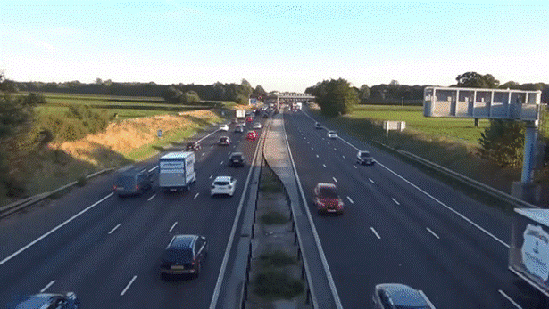

# Autonomous Traffic Data Detection and Tracking: YOLO NAS, DEEP SORT, and SODA 10M

<p align="center">
  <br>
  <em>Figure 1: Input Video</em>
</p>
<p align="center">
  <br>
  <em>Figure 2: Output Video</em>
</p>


## Overview
This repository contains the implementation of 2D object detection and tracking on traffic data, specifically using the SODA 10M dataset. We demonstrate fine-tuning the YOLO NAS model for object detection and applying the Deep SORT algorithm for 2D tracking of traffic data.

## Dataset
The dataset used is the SODA 10M dataset, which can be found at [SODA 2D official website](https://soda-2d.github.io/index.html). It is designed for Autonomous traffic data analysis.

## Repository Structure
```
.
├── checkpoints/yolonas_AI # Checkpoints for the YOLO NAS model
├── data # Data used for training and testing models
├── deep_sort_pytorch # Deep SORT algorithm implementation
├── .gitignore # Specifies intentionally untracked files to ignore
├── README.md # The README file you are currently reading
├── data_preprocessing.ipynb # Notbook for data preprocessing, converting from COCO to YOLO format.
├── detection_NAS_utils.py # Utility functions for YOLO NAS detection
├── detection_tracking_from_vedio.ipynb # Notebook for detection and tracking from video
├── nas_sort_utils.py # Utility functions for NAS and SORT integration
├── test_finetune_result.ipynb # Notebook for testing fine-tuning results
├── train_NAS_utils.py # Utility functions for training YOLO NAS
├── train_nas.ipynb # Notebook for training YOLO NAS
└── video_predictions.yaml # Output predictions in YAML format
```


## Features
- Fine-tuning of YOLO NAS model for autonomous traffic data detection.
- 2D tracking using the Deep SORT algorithm.
- Comprehensive Jupyter notebooks that guide through the detection and tracking process.
- Output predictions stored in a YAML file for further analysis.

## Getting Started
To get started with this project, clone this repository using:

```bash
git clone https://github.com/MautushiD/AI_project.git
```

## Prerequisites
python 3.10+

numpy

pandas

scikit-learn

matplotlib

tensorflow

torch

super-gradients

ultralytics

pathlib

yaml

cv2

torchvision


## Installation
Install the required dependencies:

```bash
pip install -r requirements.txt
```

> Follow the instructions in each notebook to train the models and perform detection and tracking.


## Train the YOLO NAS model:
Run the train_nas.ipynb notebook to train the model on the SODA 10M dataset.
Detection and Tracking:
Use detection_tracking_from_vedio.ipynb to perform detection and tracking on video data.
The output will be saved in ./test_video_output and ./video_predictions.yaml.
Acknowledgements
This project utilizes the SODA 10M dataset, obtained from the SODA 2D official website. We thank the creators for making the dataset publicly available for research purposes.


## Contributing
Contributions to this project are welcome. Please submit a pull request or create an issue for any features or improvements.

## License
This project is open-sourced under the MIT License. See the LICENSE file for more details.

